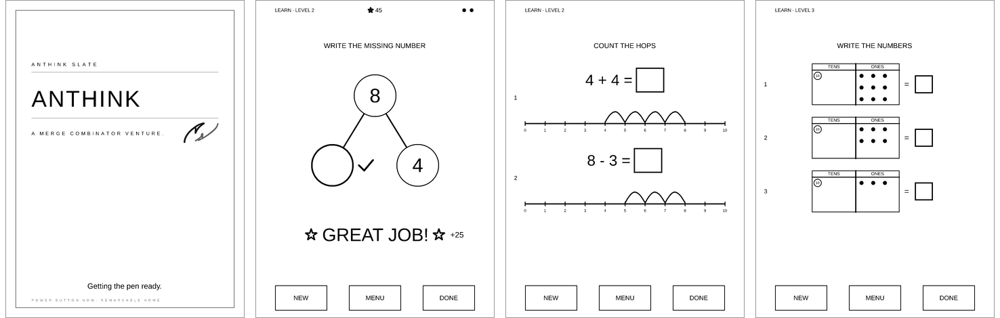

# Anthink

**A reMarkable 2 that writes back.**

Write with the pen. Rule a line beneath your words. The page reads your ink, and a
reply writes itself onto the paper, sentence by sentence, while the model is still
thinking. No keyboard, no chat window, no screen glow. Paper that answers.

<p align="center">
  
</p>

[](LICENSE)
[](https://github.com/m4ndolore/g-pad/actions/workflows/no-vendor-blob.yml)


Anthink takes over the whole tablet. The stock UI stops, the pad drives the e-ink
engine directly as root, and the pen goes straight to the panel. It runs on a
stock reMarkable 2 with SSH, no developer mode, and it builds on a laptop with no
vendor SDK.

## What it does

- **The send button is a gesture.** Draw a long flat rule under what you wrote and
  the page goes to the model. Finish the rule as an arrow and it goes to a second,
  stronger model instead.
- **Replies stream onto paper.** The reply is broken into sentences as it arrives
  and the pen starts writing seconds before the model finishes.
- **Memory in your own hand.** Finished pages stay on the tablet. Write *"show me
  what I wrote about the garden"* and that page rises through the paper, redrawn
  from your original strokes in faded ink.
- **A tutor for a four-year-old.** Learn mode deals Singapore Math worksheets
  (ten frames, number bonds, bar models, number lines, place value) and
  handwriting lines. The child answers in pencil, marks DONE, and gets a one-line
  cheer and a next step. Every two right answers unlock a drawing game.
- **Agent sessions as paper.** With the hub running on your laptop, the AGENTS tab
  shows your Claude Code sessions. Tick or strike a turn with the pen, write a
  nudge in the margin, and it is transcribed and sent back.
- **Settings without ssh.** The SYSTEM page joins Wi-Fi with an on-screen keyboard,
  switches models, tunes the pen, and powers the device down. It re-spawns the
  model process on the spot.
- **Boots into your brand.** One renderer draws the boot card, the sleep card, and
  the power-off and restart sheets, and installs the last two over the OS's own
  images. A three-second power-key window under the boot card still hands you the
  stock UI without a computer.

## How a turn works

```
 pen (raw evdev, full pressure)
   │ strokes
   ▼
 g-pad ── rule under text → commit page → PNG ──► any OpenAI-compatible
   │                                               vision endpoint (SSE)
   ▼ strokes (reply text → glyph outlines → pen paths, sentence by sentence)
 quill ── clean-room adapter over the vendor e-ink engine, xochitl stopped
```

The pad is a capture surface. The brain is whatever endpoint you point it at.
Offline means capture and queue, not unplugged and mute.

## Install on a reMarkable 2

Plug the tablet in over USB. On any machine with `ssh`:

```sh
curl -fsSL https://github.com/m4ndolore/g-pad/releases/latest/download/install.sh | bash
```

Two minutes. The installer finds the tablet, installs your SSH key so the root
password is typed once, checks the OS version, downloads the prebuilt bundle and
verifies its checksum, installs a boot unit so the pad owns the screen from
power-on, asks for a vision-capable API key, and starts the pad. Nothing to
build, no developer mode, no launcher to install. The tablet's root password is
under Settings → Help → Copyrights and licenses → GPLv3 Compliance.

```sh
curl -fsSL https://github.com/m4ndolore/g-pad/releases/latest/download/install.sh | bash -s -- --uninstall
```

puts the stock UI back. Your pages stay on the tablet until you delete them.

If anything looks wrong, `./scripts/rm2-doctor.sh` finds the tablet over USB or a
phone hotspot, reads its state without changing anything, and prints the one
command that fixes what it found. [docs/rm2-setup.md](docs/rm2-setup.md) covers
the SSH quirks and what an OS update takes away.

### Build it yourself

The build host needs Rust, `zig`, and `cargo-zigbuild`. No reMarkable SDK.

```sh
rustup target add armv7-unknown-linux-gnueabihf
brew install zig cargo-zigbuild            # or: cargo install cargo-zigbuild

./quill/build-zig.sh          # the display adapter: Debian armhf Qt headers
                              # plus three libraries copied off *your* tablet
./build-takeover-zig.sh       # the pad, linked against it
DEVICE=rm2 ./scripts/make-bundle.sh
ANTHINK_BUNDLE=dist/rm2-takeover/g-pad ./scripts/install.sh
```

> **This modifies your device.** Takeover stops the reMarkable UI and drives the
> e-ink engine directly as root. Leave with a **five-finger hold**, and xochitl
> restarts. If it ever wedges: `ssh root@10.11.99.1 'systemctl start xochitl'`.
> Tested on a reMarkable 2 on OS 3.27 and 3.28. Not affiliated with reMarkable AS.
>
> `libqsgepaper.so` is reMarkable's. The build copies it from **your** tablet, it
> is gitignored, and CI fails if it ever lands in history.

## Try it without a tablet

Everything below runs on the laptop. The tests build the page in memory and
never touch a framebuffer.

```sh
cargo test                                   # 260 tests, under three seconds
cargo build --release --features rm2
./target/release/g-pad --render-cards out/   # the boot, power-off and restart cards
./target/release/g-pad --learn-sheets out/   # every Learn worksheet, every level
```

## Gestures

| Do this | And |
|---|---|
| Write, then draw a long rule beneath it | The page goes to the model and the reply writes back |
| Finish that rule as a right-arrow | Same, to the ask model (`RIDDLE_OPENAI_ASK_MODEL`) |
| Write *"show me what I wrote about…"* | The remembered page returns in your own strokes |
| Flip the marker | Erase |
| Swipe up or down | Next or previous notebook page, or page through a long reply |
| Tap with a bare finger | Nothing. A resting hand grows no chrome |
| Two-finger tap, three-finger tap | Undo, redo |
| Swipe in from the left edge | The drawer: HISTORY, AGENTS, VAULT, BRIEF |
| Tap the corner button | The tool menu: pen, eraser, or select; which pen; what size |
| Swipe down from the top, or MORE CONTROLS in the tool menu | The control strip (Guided), or the SYSTEM page (Stealth) |
| Hold five fingers | Leave; the stock UI comes back |
| Power button | Sleep card; press again and you are exactly where you were |

A palm resting on the sheet does not count as a finger, and touch is ignored for
half a second whenever the marker is near the glass.

The tool menu drops from the corner button, the way the stock tablet's tool
bar does. TOOL picks what the tip does: PEN writes, ERASER erases, SELECT draws
a lasso. PEN picks the pen: fineliner (one width), ballpoint (pressure widens
it; the default), marker, pencil (graphite grain), or highlighter (a light band
that stays under the ink it crosses). SIZE picks fine, medium, or bold. Each pen
row shows a sample stroke at the chosen size. Picking a pen or a size keeps the
menu open and switches the tip to PEN; a tap outside, the ×, or fifteen idle
seconds close it.

With SELECT, loop the pen around strokes to pick them up. A dashed box marks the
selection: press inside it and drag to move the strokes, or tap DELETE above it
to remove them. Press outside to start a new lasso; a finger tap clears the
selection. A move or delete repaints your own strokes; printed text and the
model's handwriting under them are not repainted, the same as the eraser. Kids
mode leaves SELECT out of the menu.

The control strip has eight cells: SEND (DISMISS while a reply is up), ERASE,
NEW PAGE, HISTORY, KIDS ON/OFF, PEN/ERASER, SLEEP, SETTINGS. KIDS and the pen
tip show their state and flip on a tap; the marker's hardware eraser end always
erases regardless. In Stealth both also live on the SYSTEM page under INPUT and
LEARN.

## The modes

**Pad** is the writing surface above. HISTORY splits sittings after six hours of
silence. CORPUS, a row on the SYSTEM page's DEVICE tab, shows exactly what the
next request will carry, so nothing goes to the model that you have not seen.

**Learn** is the tutor. See [docs/learn-mode.md](docs/learn-mode.md) for the
skill ladder, the marking contract, and why a child can never send a page by
accident.

**Agent** reads Claude Code sessions from [the hub](hub/), a small Rust service
on your laptop that exports tmux transcripts and carries nudges back. Prose and
evidence are kept apart on the page: a commit hash or a path is an artifact and
claims its room first, and the pad never invents one. See
[docs/claude-bridge.md](docs/claude-bridge.md) and
[docs/capture-record.md](docs/capture-record.md).

**Vault** lists markdown notes from a Vellum gateway and reads them full-page. Ink
on a note becomes a proposed revision. Optional, off until configured.

**Brief** is one page, one day: a feed of headlines with nothing to navigate and
no article bodies, refreshed in the background and kept on the page when a
refresh fails. Point `RIDDLE_BRIEF_URL` at a JSON feed to turn it on. See
[docs/daily-brief.md](docs/daily-brief.md).

The pen interaction model behind all of them is in
[docs/anthink-interaction.md](docs/anthink-interaction.md): mark, do not
manipulate. The visual system is in [docs/ux-vignelli.md](docs/ux-vignelli.md).

## The oracle

Any OpenAI-compatible `chat/completions` endpoint that accepts images: OpenAI,
OpenRouter, Groq, Gemini's compatible endpoint, a local server. Without a key the
pad falls back to a resident `pi` process, riddle's original power path.

```sh
RIDDLE_OPENAI_KEY="sk-..."
RIDDLE_OPENAI_BASE="https://openrouter.ai/api/v1"     # optional
RIDDLE_OPENAI_MODEL="openai/gpt-4o-mini"              # must see images
RIDDLE_OPENAI_ASK_MODEL="anthropic/claude-sonnet-4"   # the arrow gesture
```

Presets in `settings.schema.json` show up on the SYSTEM page, so a model change
is a tap, not an ssh session. Put a prompt in `persona.txt` next to the binary to
replace the default voice. `oracle.env.example` documents every `RIDDLE_*`
variable: memory, palm holdoff, idle send, the bridge, the vault, the tutor
model.

Verify on the device with `g-pad --oracle-test icon.png`.

## Why it is built this way

- **Five crates.** `libc`, `signal-hook`, `png`, `ab_glyph`, and `ureq` with
  rustls. No async runtime, no serde. JSON is parsed by hand so the binary stays
  small and cross-compiles cleanly to 32-bit ARM.
- **Gestures are local.** Recognition is geometry on the strokes. A gesture
  works with no network.
- **Tested on the laptop.** 260 tests cover SSE decoding, the stream parser,
  gesture geometry, palm tolerance, pixel-exact sleep restore, and the SYSTEM
  page hit map, all against an in-memory surface.
- **No SDK.** The display adapter is built with zig, Qt headers from a Debian
  armhf package, and three libraries copied from the tablet you own. The link
  step records a bare library name so the binary resolves on the device.
- **Nothing proprietary in the tree.** [quill/CLEANROOM.md](quill/CLEANROOM.md)
  explains the adapter, and a CI job scans every commit for the vendor blob.

## Status

Live on a reMarkable 2 running OS 3.28.0.172. Pad, Learn, SYSTEM, the boot
branding, and the Agent bridge are in daily use. The BRIEF tab is the newest
surface and has not yet had a day on hardware. The windowed build for the stock
UI is not maintained; takeover is the product.

## Origins

Anthink began as a reMarkable 2 port of [riddle](https://github.com/MaximeRivest/riddle)
(MIT), the diary that writes back on the Paper Pro, and grew the takeover boot,
the tutor, the agent bridge, and the SYSTEM page. The display adapter is a vendored
[quill](https://github.com/MaximeRivest/quill), rebuilt for OS 3.28 without the
SDK. Copyright notices are in [NOTICE](NOTICE).

The device is the **Anthink Slate**, a [Merge Combinator](https://mergecombinator.com)
venture. The binary, its data directory, and the `RIDDLE_*` environment keep
their original names.

## License

MIT. Retain the copyright notices in LICENSE. Quill has its own MIT LICENSE under
`quill/`.
